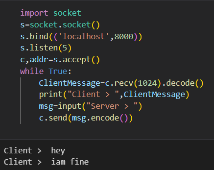
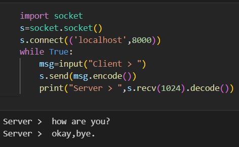

# EX-9 APPLICATION USING TCP SOCKETS - CREATING FOR CHAT CLIENT-SERVER


# DATE :04.05.2023
# AIM :
#### To write a python program for creating Chat using TCP Sockets Links.

# ALGORITHM :

#### 1.Start the program.
#### 2.Get the frame size from the user.
#### 3.To create the frame based on the user request.
#### 4.To send frames to server from the client side.
#### 5.If your frames reach the server, it will send ACK signal to client otherwise it will sendNACK signal to client.
#### 6.Stop the program


# CLIENT PROGRAM :
```PY
## Developed : SOUVIK KUNDU
## Reg no : 212221230105
import socket
s=socket.socket()
s.connect(('localhost',8000))
while True:
    msg=input("Client > ")
    s.send(msg.encode())
    print("Server > ",s.recv(1024).decode())


```
# SERVER PROGRAM :
```PY
import socket
s=socket.socket()
s.bind(('localhost',8000))
s.listen(5)
c,addr=s.accept()
while True:
    ClientMessage=c.recv(1024).decode()
    print("Client > ",ClientMessage)
    msg=input("Server > ")
    c.send(msg.encode())

```

# SERVER OUTPUT :


# CLIENT OUTPUT : 



# RESULT:
#### Thus, the python program for creating Chat using TCP Sockets Links was successfully created and executed.


